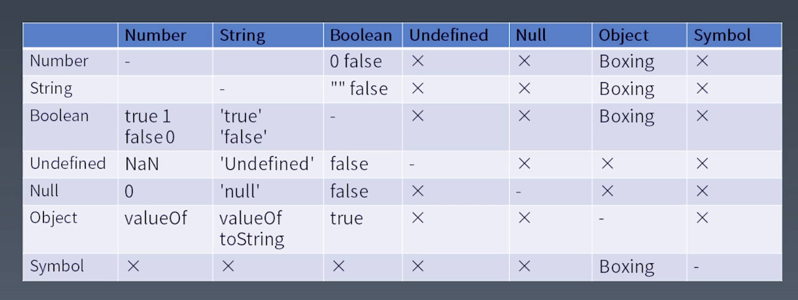

学习笔记

## 运算符和表达式

### 语法树和优先级的关系

优先级更高的运算符会形成更小一级的语法结构也就是子语法树。 （也就是较末一级的结构）

（1） `Member`

__最高优先级__

运算符优先级最高的是 `Member` 运算（类似 `a.b` 这样发的结构）。

1. `a.b`
1. `a[b]`
1. `foo`\`string\`
1. `super.b`
1. `super['b']`
1. `new.target`
1. `new Foo()`


次一级的运算符

1. `new Foo`


（2） Refrence

1. `Object` 
1. `Key` 
1. `delete`
1. `assign`


（3） Call Expressions

1. `foo()`
1. `super()`
1. `foo()[b]` (`Merber` 运算降级为 `Call Expression`)
1. `foo().b` (`Merber` 运算降级为 `Call Expression`)
1. `foo()`\`abc\` (`Merber` 运算降级为 `Call Expression`)

使用产生式来描述优先级更为严谨。

（4） Left Handside & Right Handside Expressions

1. `a.b = c` 其中的 `a.b` 是 `Left Handside Expression` `c` 是 `Right Handside Expressions`

`Right Handside Expressions` 属于 `Left Handside Expression`  反过来不一定成立

只有 `Right Handside Expressions` 能放在等号的左边

（5） Unary Expressions

1. `delete` a.b
1. `void` foo() 可以起到改变语法结构的作用
1. `typeof` a
1. `+` a
1. `-` a
1. `~` a
1. `!` a
1. `await` a

（6） Exponenal

1. `**` 一个右结合的运算符

（7） Multiplitcative 、Addtive 、Shift 、Relationship Expressions

1. Multiplitcative `*` 、 `/` 、 `%`
1. Addtive `+` 、 `-`
1. Shift `<<` 、`>>` 、`>>>`
1. Relationship `<`、`>`、`<=`、`>=` 、`instanceof`、`in`

（8） Equality & Bitwise Expressions

Equality

1. `==`
1. `!=`
1. `===`
1. `!==`

Bitwise

1. `&`、`^`、`|`


## 类型转换




### Unboxing 拆箱转换 （将Object转换成普通类型）

1. ToPermitive
1. toString vs valueOf
1. Symbol.toPrimitive 如果定义了 `Symbol.toPrimitive` 则会忽略 `toString` 和 `valueOf`


`+` 法运算优先调用 `valueOf`

作为属性名使用的时候会优先调用 `toString` 方法


### Boxing 装箱转换

1. Number
1. String
1. Boolean
1. Symbol

前三种使用 new 调用会将值装入一个 Object 对象内

最后一种使用 new Object 调用会将值装入一个 Object 对象内

使用 `==` 比较结果为 `true` 使用 `===` 比较结果为 `false`

当使用 `Member` 去访问属性的时候如果变量是基础变量 则会自动进行装箱转换。

### StringToNumber

```js
function StringToNumber(value){
    if(typeof value !== 'string') return
    if(value.length>=16){
        if(BigInt(value) > BigInt(9007199254740991)){
            return 
        }
        if(BigInt(value) < BigInt(-9007199254740991)){
            return 
        }
    }
   if(value.startsWith('0x')||value.startsWith('0X')){
       return parseInt(value.substring(2),16)
   }
   if(value.startsWith('0o')){
       return parseInt(value.substring(2),8)
   }
   if(value.startsWith('0b')){
       return parseInt(value.substring(2),2)
   }
   return parseFloat(value,10)
```

### NumberToString

```js
function NumberToString(number,system){
    if(Number.isInterger(value) && !Number.isSafeInterger(value)) return
    return value.soString(system)
}
```


