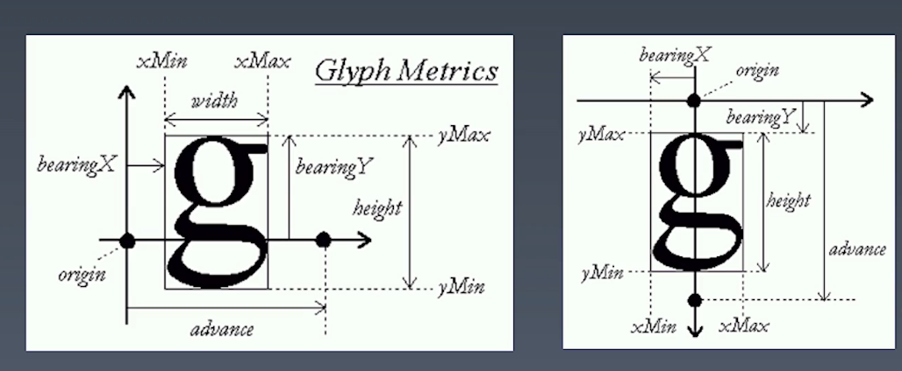
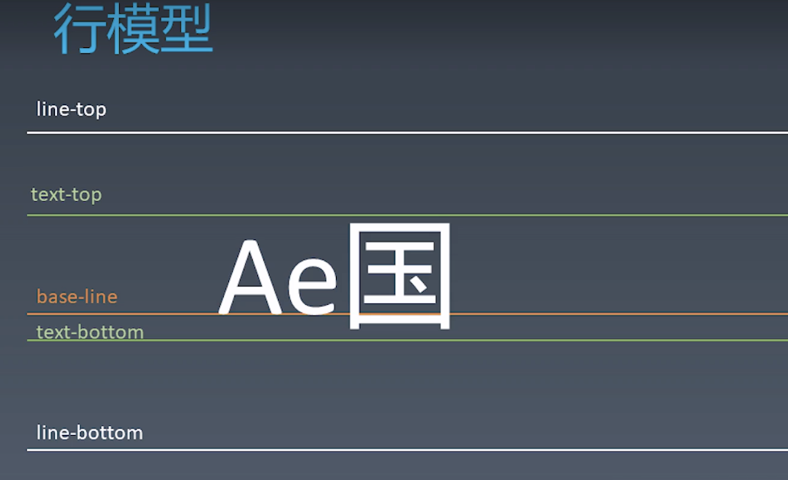
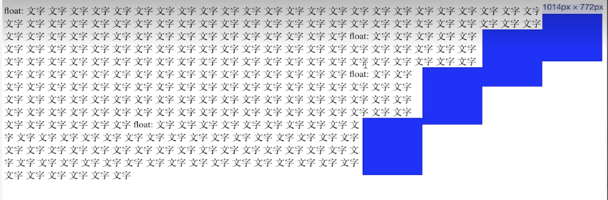

学习笔记

## CSS 排版 ｜ 盒

|源代码|语意|表现|
|:---:|:---:|:---:|
|标签|元素|盒|
|Tag|Element|Box|

HTML代码中可以书写开始标签，结束标签和自封闭标签。

一对起止标签表示一个元素。

DOM树中存储的是元素和其他类型的节点（Node）。

CSS选择器选中的是元素（或伪元素）。

CSS选择器选中的元素，在排版时可能产生多个盒。

排版和渲染的基本单位是盒。

### 盒模型

外边距：margin

内边距：padding

边框：border

宽：width

高：height

怪异盒模型

box-sizing:border-box

width = width + padding + border

标准盒模型

box-sizing:content-box

width = width

## CSS 排版 ｜正常流

思考:

我们如何写字？

1. 从左到右书写
1. 同一行的文字都是对齐的
1. 一行写满了，就换到下一行

### 正常流排版

1. 收集盒和文字进行
1. 计算盒和文字在行中的排布
1. 计算行的排布

计算行的排布叫 IFC  inline-level-formatting-context （行内级格式化上下文）

计算列排布叫 BFC block-level-formatting-context （块级格式化上下文）

### CSS排版 ｜ 正常流的行级排布

### Baseline

### Text

### 行模型

在文本和 line-box 混排的时候如果 line-box 高度很高（假设line-box和text-botton对齐) 会影响line-top（line-bottom）的位置但是不会影响 text-top 和 text-bottom 的位置

这些属性可以通过 `vertical-align` 去设置。

## CSS 排版｜正常流的块级排布

float 是基于正常流的一种非正常流排布，在基于正常流的情况下计算元素之后如果该元素有 float 属性则会让该元素往相应的方向移动移动到最右边或者最左边，或者是最靠近已经浮动的元素的位置（即会受上一个浮动元素的影响）。

如图:

`clear:float` 能实现让浮动的元素不紧挨着上一个浮动元素，而是选择没有浮动的元素的位置进行排版。
所以 clear:float 并不是清除浮动的意思，而是找一个干净的没有浮动元素的位置排版的意思。

可以理解为 `clear:float` 能使得 float 元素换行。

float 会使得 text 和 float 元素 发生重排 所以不建议频繁的使用 float 推荐使用 flex 布局或者 grid 布局。

### BFC margin 折叠  (Margin Collapse)

在 __正常流__ 的 __BFC__ 中 `margin-top` 和 `margin-bottom` 会折叠成一部分最终的空白是 `margin-top` 与 `margin-bottom` 的最大值。也叫留白的折叠现象或者边距的留白现象。

因为只要求周围有这么多空白，并没有要求要与别的元素的边距有那么大的空白。所以只要空白距离满足了即可。

## CSS 排版 ｜ BFC 合并

Block Contaniner: 里面有 BFC 

Block-lever Box: 外面有 BFC 的

Block Box = Block Container + Block-level Box: 里外都有 BFC 的

### Block Container

1. block
1. inline-block
1. table-cell
1. flex item
1. grid cell
1. table-caption

### Block-Level Box

Block level

1. display:block
1. display:flex
1. display:table
1. display:grid
...

Inline level

1. display:inline-block
1. display:inline-table
1. display:inline-table
1. display:inline-grid
...

### BFC 合并

block box && overflow:visibale 会发生 BFC 合并

1. BFC 合并与 float
1. BFC 合并与边距折叠

