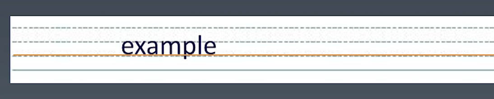

学习笔记

## CSS 排版 ｜ 盒

|源代码|语意|表现|
|:---:|:---:|:---:|
|标签|元素|盒|
|Tag|Element|Box|

HTML代码中可以书写开始标签，结束标签和自封闭标签。

一对起止标签表示一个元素。

DOM树中存储的是元素和其他类型的节点（Node）。

CSS选择器选中的是元素（或伪元素）。

CSS选择器选中的元素，在排版时可能产生多个盒。

排版和渲染的基本单位是盒。

### 盒模型

外边距：margin

内边距：padding

边框：border

宽：width

高：height

怪异盒模型

box-sizing:border-box

width = width + padding + border

标准盒模型

box-sizing:content-box

width = width

## CSS 排版 ｜正常流

思考:

我们如何写字？

1. 从左到右书写
1. 同一行的文字都是对齐的
1. 一行写满了，就换到下一行

### 正常流排版

1. 收集盒和文字进行
1. 计算盒和文字在行中的排布
1. 计算行的排布

计算行的排布叫 IFC  inline-level-formatting-context （行内级格式化上下文）

计算列排布叫 BFC block-level-formatting-context （块级格式化上下文）

### CSS排版 ｜ 正常流的行级排布

### Baseline

### Text

### 行模型

在文本和 line-box 混排的时候如果 line-box 高度很高（假设line-box和text-botton对齐) 会影响line-top（line-bottom）的位置但是不会影响 text-top 和 text-bottom 的位置

这些属性可以通过 `vertical-align` 去设置。

