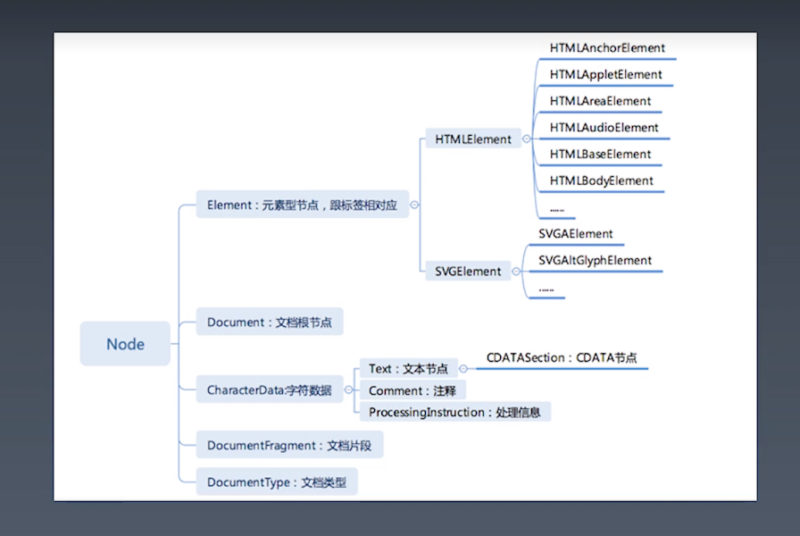

学习笔记

## 重学HTML ｜ HTML定义 XML 与 SGML

HTML的定义：XML 与 SGML

发展到 HTML5.0 以后就越来越独立于 XML 与 SGML 了是接受了 XML 与 SGML 灵感的独立语言

### DTD 与 XML namespace

1. http://www.w3.org/TR/xhtml1/DTD/xhtml1-strict.dtd
1. http://www.w3.org/1999/xhtml

当我们用 `&nbsp` 来进行排版的适合会出现分词问题原因是 `&nbsp` 是 no-break space 它不会把两端的词打断。
建议使用 css 里面 white space

`&#955` 或者 `&lambda` 是 lambda 表达式

`&quot` 双引号 

`&amp` & 符号

`&lt` 小于号

`&gt` 大于号

## 重学 HTML ｜ HTML 标签语义

`main` 表示主体

`p` 段落

`nav` 导航栏

`aside` 侧边栏

`article` 文章 一般在主体内就是文章

`em` 是表示重音词汇，且加粗。

`strong` 是单纯的加粗并不改变语义结构。

`figure` 图片文字组合

`img` 图片

`figcaption` 文字

`hgruop` 配合 `h1-h6` 使用

`code` 配合 `pre` 使用

`dfn` 定义

`samp` 示例、样本

## 重学 HTML | HTML 语法

### 合法元素

- Element:`<tagname>...<tagename>`
- Text: `text`
- Commentt:`<!-- comments -->`
- DocumentType: `<!Docutype html>`
- ProcessingInstruction: `<?a 1?>`
- CDATA:`<![CDATA[]]>`

### 字符引用

- `&#161;`
- `&amp;`
- `&lt;`
- `&quot;`

## 浏览器API ｜ DOM API

### 导航类操作

- parentNode  parentElement
- childNodes children
- firstChild firstElementChild
- lastChild lastElementChild
- nextSibling nextElementSibling
- previousSibling previusElemeneSibling

### 修改操作

- appendChild
- insertBefore
- removeChild
- replaceChild

### 高级操作

- compareDocumentPosition 是用于比较两个节点中关系的函数
- cintains 检查一个节点是否包含另一个节点的函数
- isEqualNode 检查两个节点是否完全相同
- isSameNode 检查两个节点是否是同一个节点，实际上在 javaScript 中可以使用 `===`
- cloneNode 复制一个节点，如果传入 true， 则会连同子元素做深拷贝。