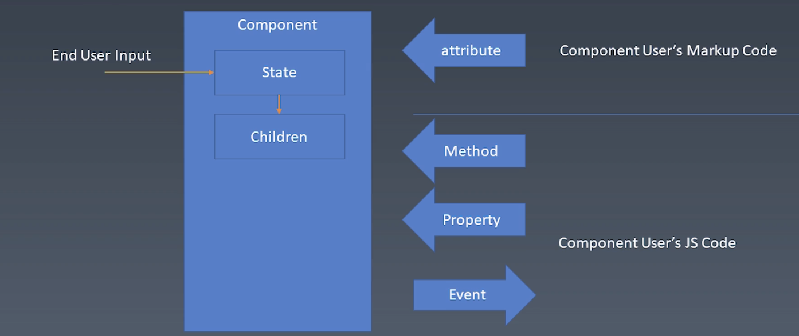
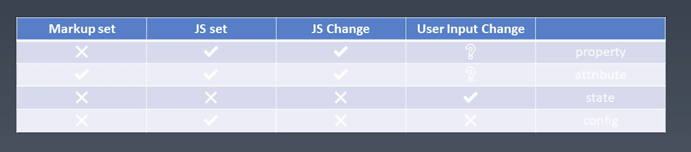
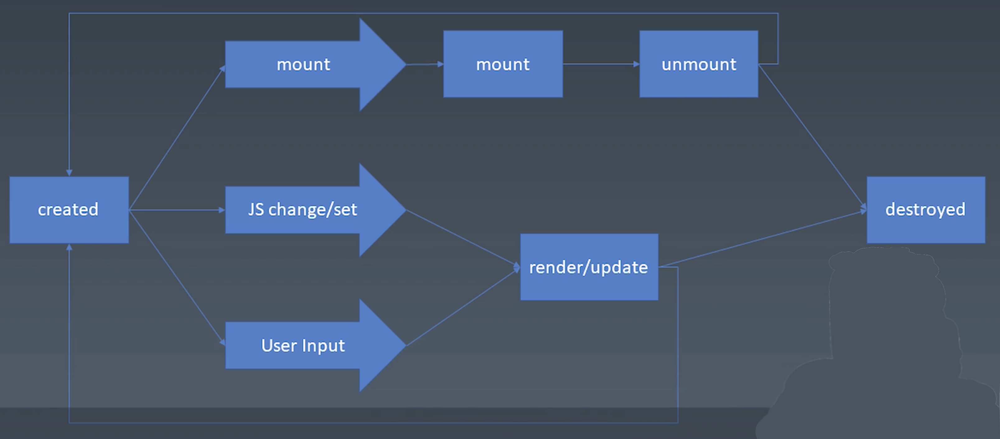

学习笔记

## 组件化（一）

组件的基本知识 ｜ 组件的基本概念和基本组成部分


帮助前端团队提升代码复用率，减少心智负担。


### 对象与组件

__对象__:

- Properties
- Methods
- inherit (继承关系)

__组件__:

与 UI 强相关即是模块也是对象。

- Properties
- Methods
- inherit
- __Attribute__
- __Config & State__
- __Event__
- __Lifecycle__
- __Children__


### Component



用户输入影响：


state


使用组件的程序员向开发组件的程序员发送消息通过：


attribute 


Method


Property


开发组件的程序员向使用组件的程序员发送消息通过：


Event


### Attribute 和 Property 的区别


Attribute 是一个属性 


比如一个人很帅


头发是黑色的 


皮肤是黄色的等等


但是 Property 强调一种从属关系


比如一个对象引用了另一个对象


一个对象弱引用了某个属性或者对象


### Attribute vs Property

Attribute:

```html
<my-component attribute="v"/>
```

```js
myComponent.getAttribute("a")
myComponent.setAttribute("a","value")
```

Property:

```js
myComponent.a = "value"
```

行为区别1:

```html
<div class="cls1 cls2"></div>
<script>
var div = document.getElmentsByTagName('div')
div.className // cls1 cls
</script>
```
早起浏览器不允许 js 通过 class 关键字访问，现在可以了，但是 html 中还不行，必须通过 className 访问。


行为区别2:

```html
<div class="cls1 cls2" style="color:blue"></div>
<script>
var div = document.getElmentsByTagName('div')[0]
div.style // 对象
</script>
```

行为区别3:


```html
<a href="//m.taobao.com"></a>
<script>
var a = document.getElmentsByTagName('a')[0]
a.href // "http://m.taobao.com", 这个URL 是 resolve 过的结果
a.getAttribute('href') // "//m.taobao.com", 跟 HTML 代码中完全一致
<script>
```

行为区别4:

```html
<input value="cute"/>
<script>
var input = document.getElementsByTagName('input')[0]; // 若 property 没有设置则结果是 attribute
input.value // cute
input.getAttribute('value') // cute
input.value = 'hello' // 若元素上已经设置，则 attribute 不变， property 变化， 元素上实际的效果是 property 优先
input.value // hello
input.getAttribute('value') // cute
</script>
```

#### 如何设计组件状态




### Lifecycle




### Children

- Content 型 Children 与 Template 型 Children

```html
<my-button>
    {{title}}
</my-button>

<my-list>
    <li>
        {{title}}
    </li>
</my-list>
```