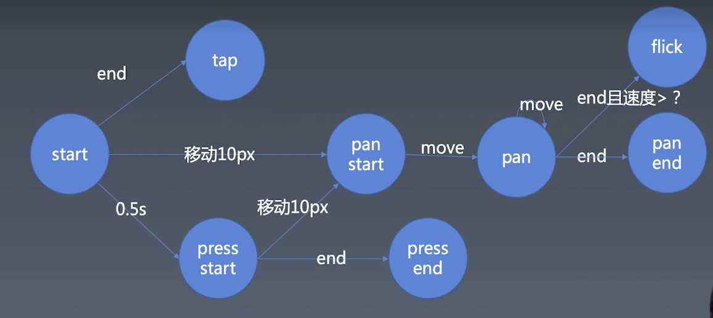

学习笔记

## 手势与动画 | 初步建立动画和时间线

## 手势与动画 ｜ 手势的基本知识

## 手势与动画 ｜ 实现鼠标操作

### gesture 的封装

1. 封装 gesture 的时候要考虑到移动端事件
1. 移动端事件和PC端事件不一样，移动端事件只有在出发`touchstart`事件以后才会出发`touchmove` 而 PC 端的 `mousemove` 事件则只需要晃动鼠标即刻触发
1. 移动端事件还需注意 `touchcancel` 以及多点触摸 `event.changedTouches` 是一个数组里面存了多个 point

## 手势与动画 ｜ 实现手势的逻辑

